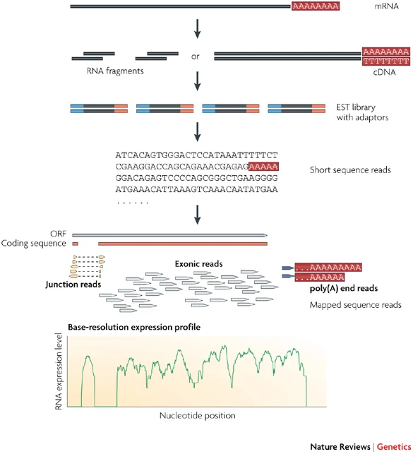

# RNA-Seq Technology in Personalized Cancer Treatment
By Shirley Xie, Charles Choi, Jiachen Xu

## Introduction

### Personalized Cancer treatment
Personalized cancer treatment, often referred to as precision medicine or personalized medicine, involves tailoring medical care to the individual characteristics of each patient and their specific type of cancer. This approach aims to optimize treatment effectiveness while minimizing side effects by considering factors such as genetic makeup, molecular profiles of tumors, lifestyle, and other individual factors.

Genetic testing helps identify specific mutations or alterations within a patient's cancer cells. This information can guide treatment decisions, including targeted therapies that address the unique genetic features of the tumor.

> In subsequent sections, we will talk about the utilization of RNA-Seq and differential expression analysis in personalized cancer treatment.

### Why Do We Choose RNA-seq?
RNA-Seq (RNA sequencing) is a powerful and widely used technique in molecular biology and genomics. It's a method used to analyze the presence and quantity of RNA in a biological sample, providing valuable insights into levels of gene expression, alternative splicing, and transcriptomic changes within cells or tissues. These information can be analyzed and utilized to predict treatment outcomes of different medication plans, to monitor the progress and efficacy of treatment, and on the large scale contributes to our understanding of the relations between DNA sequence, expression pattern, and optimal treatment plan of each subtype of cancer.

Figure 1. Basic workflow of RNA-seq [1].

### Why Do We Choose Differential Expression Analysis?
Differential Expression analysis is a fundamental method used in genomics and transcriptomics to compare gene expression levels between different conditions or groups, such as healthy vs. diseased samples, treated vs. untreated samples, or different developmental stages. By pinpointing genes that are differentially expressed in an individual's tumor, DE analysis aids in the identification of specific molecular targets or pathways that can be therapeutically exploited. This precision allows for the development of targeted therapies tailored to the unique genetic characteristics of the tumor. DE analysis helps stratify patients into subgroups based on gene expression profiles, enabling the selection of the most appropriate and effective treatment strategies for each subgroup. It assists in personalizing treatment regimens, optimizing therapeutic outcomes, and minimizing adverse effects.

* * *

## Method

* * *

## Evaluation of Using RNA-Seq in Personalized Cancer Treatment

* * *

### Advantages

1. Comprehensive Gene Expression Profiling:
RNA-Seq provides a comprehensive view of gene expression in cancer cells, allowing for a detailed analysis of the transcriptome. This enables the identification of specific genes and pathways that are dysregulated in an individual's cancer, offering insights into the underlying biology of the disease.

2. Detection of Genetic Alterations and Mutations:
RNA-Seq can detect genetic alterations, mutations, and variations in gene expression specific to an individual's tumor. It helps in identifying driver mutations, fusion genes, and other genetic abnormalities that could be targeted for personalized therapy.

3. Identification of Therapeutic Targets:
By revealing the unique molecular characteristics of a tumor, RNA-Seq aids in the identification of potential therapeutic targets. It enables oncologists to match specific drugs or targeted therapies that are most likely to be effective against the patient's tumor profile, leading to more precise and effective treatments.

4. Prediction of Treatment Response:
RNA-Seq data can be used to predict how a patient might respond to certain treatments. By analyzing gene expression patterns, researchers and clinicians can anticipate the effectiveness of particular drugs or therapies, helping in the selection of the most appropriate treatment strategy.

5. Monitoring Treatment Efficacy and Resistance:
Monitoring changes in gene expression during the course of treatment using RNA-Seq allows for the early detection of treatment response or resistance. This information can guide adjustments in treatment plans to overcome resistance mechanisms and improve patient outcomes.

6. Personalized Immunotherapy:
RNA-Seq assists in identifying specific tumor antigens or immune-related genes expressed in a patient's tumor. This information is valuable in designing personalized immunotherapies, such as cancer vaccines or adoptive cell therapies, to stimulate the patient's immune system against the tumor.

7. Potential for Discovering Novel Biomarkers:
RNA-Seq analysis may reveal novel biomarkers associated with treatment response, disease progression, or prognosis. These biomarkers can aid in patient stratification, clinical decision-making, and the development of new targeted therapies.

### Disadvantages

1. Cost and Technical Complexity:
Costly Procedures: RNA-Seq involves high costs, including library preparation, sequencing, computational resources, and expertise.
Technical Expertise: Data analysis requires bioinformatics expertise, and the complexity of workflows demands skilled personnel.

2. Data Analysis Challenges:
Computational Burden: Analyzing large-scale RNA-Seq datasets can be computationally intensive and time-consuming.
Normalization and Variability: Normalizing data across samples and accounting for biological and technical variability can be challenging.

3. Sensitivity to Experimental Variables:
Sample Quality: RNA-Seq results can be affected by the quality and integrity of RNA samples, which may vary among different sample types or handling procedures.
Batch Effects: Variability between different sequencing runs or batches might introduce unwanted biases in the results.

4. Transcriptome Complexity:
Alternative Splicing and Isoforms: RNA-Seq might struggle to accurately capture and quantify alternative splicing events and rare transcript isoforms due to their complexity.

5. Limited Sensitivity for Low-Abundance Transcripts:
Detection Limits: RNA-Seq might miss detection of very low-abundance transcripts, leading to underrepresentation of rare transcripts.

6. Integration Challenges:
Integrating Multi-Omics Data: Integrating RNA-Seq data with other omics data (genomics, proteomics) can be challenging and requires sophisticated analytical approaches.

7. Standardization and Reproducibility:
Standardization Issues: Lack of standardized protocols across laboratories can lead to variability in results.
Reproducibility: Variability in results between studies or labs might affect the reliability of findings.

8. Ethical and Regulatory Challenges:
Data Privacy and Security: Handling patient genomic data raises concerns about privacy and security, necessitating stringent regulations and ethical considerations.

* * *

## Future Directions

1. Single-Cell RNA-Seq (scRNA-Seq):
Single-Cell Resolution: Advancements in scRNA-Seq enable the analysis of individual cells within a tumor, providing insights into intra-tumoral heterogeneity and identifying rare cell populations. This could lead to more precise understanding of tumor biology and personalized treatment strategies.

2. Long-Read Sequencing Technologies:
Improved Transcriptome Coverage: Long-read sequencing technologies, such as Oxford Nanopore and PacBio, offer enhanced capabilities in capturing full-length transcripts and resolving complex RNA structures, addressing limitations related to alternative splicing and isoform identification.

3. Integration of Multi-Omics Data:
Multi-Omics Integration: Integrating RNA-Seq data with other omics data (genomics, epigenomics, proteomics) allows for a more comprehensive understanding of tumor biology, facilitating the discovery of new therapeutic targets and biomarkers.

4. Development of Computational Tools:
Advanced Bioinformatics Tools: Continued development of sophisticated algorithms and computational tools for data analysis, normalization, and interpretation will improve the accuracy and efficiency of extracting meaningful information from RNA-Seq datasets.

5. Functional Annotation of Transcriptomes:
Functional Annotation: Efforts to annotate and understand the functional roles of non-coding RNAs, alternative splicing events, and regulatory elements within the transcriptome will deepen our understanding of their impact on cancer biology and potential therapeutic implications.

6. Predictive Modeling and Machine Learning:
Predictive Models: Integration of machine learning and predictive modeling approaches with RNA-Seq data may improve the prediction of treatment response, patient outcomes, and identification of personalized treatment strategies.

7. Clinical Translation and Implementation:
Clinical Applications: Further translation of RNA-Seq findings into clinical practice, including the development of standardized protocols and guidelines for using RNA-Seq in guiding treatment decisions and patient care.

8. Biomarker Discovery and Drug Development:
Biomarker Identification: Ongoing efforts to identify novel biomarkers associated with treatment response, disease progression, and prognosis will aid in patient stratification and the development of targeted therapies.

9. Ethical Considerations and Data Sharing:
Data Ethics and Sharing: Continued focus on ethical considerations regarding patient data, ensuring privacy, and promoting responsible data sharing to accelerate research and improve personalized cancer treatment.

* * *

## Reference

[1]: Wang, Z., Gerstein, M. & Snyder, M. RNA-Seq: a revolutionary tool for transcriptomics. Nat Rev Genet 10, 57–63 (2009). https://doi.org/10.1038/nrg2484
