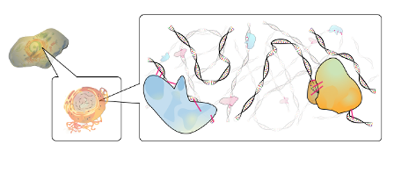
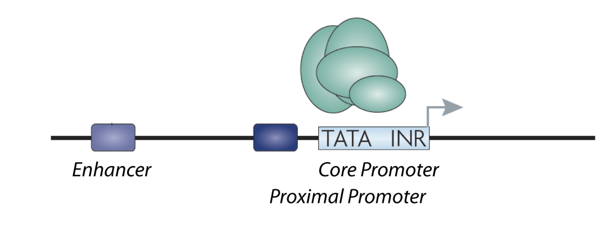
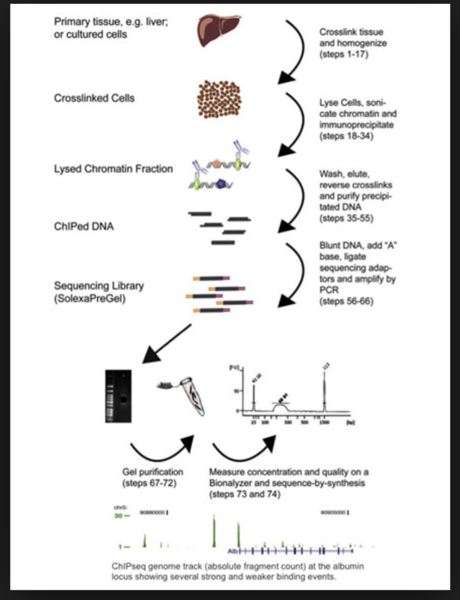

# CHIP-Sequencing 
###### BENG183 Final Paper date:12-14-2018 
###### Group 5 Yiyang Yin A92112108

1. [Introduction](#1)
2. [History](#2)
3. [The Goal of CHIP-Sequencing](#3)
4. [Understanding functional features of the genome](#4) 
    4.1. [Nucleosome](#41) 
    4.2. [Transcription Factors and TF binding sites](#42) 
    4.3. [Histone Modification](#43) 
    4.4. [Insulator](#44)
5. [Overivew of Chip-Squencing](#5) 
    5.1. [The workflow of CHIP-Sequencing](#51) 
    5.2. [Experimental Design](#52)
6. [Data Analysis](#6) 
    6.1. [FastQ File Format](#61) 
    6.2. [Downstream Analysis](#62)
7. [Advantages of Chip-Sequencing](#7)
8. [Applications](#8)

## 1. Introduction

Chromatin-immunoprecipitation (ChIP) followed by sequencing of the immuno-precipitated DNA is a powerful tool for the investigation of Protein-DNA interactions. To perform ChIP-seq, chromatin is isolated from cells or tissues and fragmented. Antibodies against chromatin associated proteins are used to enrich for specific chromatin fragments. The DNA is recovered, sequenced and aligned to a reference genome to determine specific protein binding loci. ChIP studies have increased our knowledge of transcription factor biology, DNA methylation and histone modifications.

Typical steps in CHIP-Sequencing:
- **Cross-link**
- **Selection**
- **Alignment**

## 2. History

In 2007, there was a race to develop CHIP-Sequencing. At least three groups worked to
develop a genome-wide assay of protein binding. The three papers were submitted to
three separate journals.
- Mikkelsen et al. from the Broad submitted to
Nature and was published in August.
- Johnson et al. from Stanford submitted to
Science and was published in June.
- Barski et al. from NHLBI, NIH submitted to Cell
and was published in May.

 
Barski, along with Dr. Zhao's lab is recognized to be the first.

## 3. The Goal of CHIP-Sequencing

- **Determine the binding sites of various proteins in the genome**
- **Pridict regulation of certain genes in cells**
- **Derive binding motifications of certain transcription factors by studying their common binding sites**

All in all, CHIP-Sequencing focus on gene regulation via DNA sequencing method.

## 4. Understanding functional features of the genome

CHIP-Sequencing involves various concepts in genome study. Before we dive into the actual process, let us quickly remind ourselves of several definitions.

#### 1) Nucleosome

A nucleosome is a basic unit of DNA packaging, consisting of a segment of DNA wound around eight histone protein cores.

#### 2) Transcription Factors and TF binding sites

Transcription factors regulates gene expression by interacting with various binding sites.

- Core Promoter

    Core promoter is the minimal portion of the promoter required to properly initiate transcription, and it contains transcription start site (TSS), a binding site for RNA polymerase and some general transcription factor binding sites, such as TATA box

- Proximal promoter( Enhancer,Silencer ) 
  
    Proximal promoter is the proximal sequence upstream of the gene that tends to contain primary regulatory elements, such as enhancer and silencer

#### 3) Histone Modification

A covalent post-translational modification (PTM) to histone proteins includes methylation, phosphorylation, acetylation, ubiquitylation, and sumoylation. The PTMs made to histones can impact gene expression by altering chromatin structure or recruiting histone modifiers. 

#### 4) Insulators

Function either as an enhancer-blocker or a barrier, or both， an insulator performs these two functions include loop formation and nucleosome modifications.

## 5. Overivew of Chip-Squencing

#### 1) The workflow of CHIP-Sequencing

The basic workflow is to isolate the target nuclei and then covalently **cross link** the proteins to DNA. Then the chromatin is sheared by sonication or enzymatically digested into small pieces of fragment so that these small fragments can be suitable for sequencing. Then an **antibody against the specific protein or protein modification** is used to bring down the protein bound to DNA. Then these chromatin is **sheared and immunoprecipitated** with antibody-bound magnetic beads. After that **cross linking is reversed**, and DNA is purified. These immunoprecipitated and purified DNA is then used as the input for a next-generation sequencing library prep protocol, where it is sequenced and analyzed for DNA binding sites.

- **Cross-link**

Proteins are cross-linked to their bound DNA by formaldehyde, cells are homogenized.

- **Selection**

Chromatin is sheared and immunoprecipitated with antibody-bound magnetic beads.

- **Alignment**

Immunoprecipitated DNA is then used as the input for a next-generation sequencing library prep protocol, where it sequenced and analysed for DNA binding sites.

#### 2) Experimental Design

During the whole CHIP-Sequencing process, many small details could affact the accuracy of our data. To eliminate possible noises from our experiment, designated lab protocol is formed, as the picture shows.

## 6. Data Analysis

#### 1) FASTQ file format

After wet lab process, it is time for data analyzing. In most CHIP-Sequencing protocols, we acquire raw sequence data in the FASTQ format, a text-based format for storing both a biological sequence and its corresponding quality scores.

For each cluster that passes filter, a single sequence is written to the corresponding sample’s R1 FASTQ file, and, for a paired-end run, a single sequence is also written to the sample’s R2 FASTQ file. Each entry in a FASTQ files consists of 4 lines:

- A sequence identifier with information about the sequencing run and the cluster. The exact contents of this line vary based on the BCL to FASTQ conversion software used.
- The sequence (the base calls; A, C, T, G and N).
- A separator, which is simply a plus (+) sign.
- The base call quality scores. These are Phred +33 encoded, using ASCII characters to represent the numerical quality scores.

#### 2) Down Stream Analysis

ChIP-seq analysis begins with mapping of trimmed sequence reads to a reference genome. Next, peaks are found using peak-calling algorithms. To further analyze the data, binding or motif analysis are common end points of ChIP-seq workflows. At every stage, the choice of method or algorithm and the parameters used will affect the downstream results.

It is very important to look into noise reduction for the data we get. Typically, noise comes from these features:
- **bad mapping algorithm**
- **bad antibody design**
- **multiple binding sites**
- **variation on number of DNA copies**

We can use negative control experiments to determine the background noise of performed experiment.

## 7. Advantages of CHIP-Sequencing

CHIP-Sequencing has several unique advantages comparing to existing methods.

- **Generality**

    Captures DNA targets for transcription factors or histone modifications across the entire genome of any organism.

- **Defines transcription factor binding sites**

- **Multipurpose**

    Reveals gene regulatory networks in combination with RNA sequencing and methylation analysis.

- **Offers compatibility with various input DNA samples**

## 8. Applications

Although CHIP-Sequencing is a newly developed method, it has inspired many advancements.

- **The ENCODE Project**

    The National Human Genome Research Institute (NHGRI) supports the public research consortium named ENCODE, the Encyclopedia Of DNA Elements, to identify all functional elements in the human and mouse genomes.

    ENCODE has produced vast amounts of data that can be accessed through the project's freely accessible database, the ENCODE Portal.  The ENCODE "Encyclopedia" organizes these data into two levels of annotations:  1) integrative-level annotations, including a registry of candidate cis-regulatory elements and 2) ground-level annotations derived directly from experimental data. 

    As a result of outreach and collaboration, ENCODE data are widely used. Lists of publications using ENCODE resources can be found on the ENCODE Portal. The ENCODE Portal also hosts data from modENCODE as well as data from the RoadMap Epigenomics and Genomics of Gene Regulation projects.

- **FoxA1 Knock-down**

    Antoni Hurtado, et al. performed knock-down of the FoxA1 “pioneer factor”, resulting in reduced binding by the estrogen receptor (ER) at over 50% of known ER binding sites. They showed that FoxA1 is an important regulator of ER-mediated transcription, suggesting it may be a new and important therapeutic target in breast cancer (Hurtado 2011).

- **TF binding evolution**

    Dominic Shmidt, et al. used ChIP-seq to investigate the evolution of transcription factor binding. They focused on CEBPA and HNF4 binding in the liver tissue of five vertebrate species: human, mouse, dog, opossum and chicken. ChIP-chip would have been almost impossible given the different species involved and complexities in designing probes (Schmidt 2010).

## Reference

[1]https://www.genome.gov/10005107/the-encode-project-encyclopedia-of-dna-elements/

[2]https://www.nhlbi.nih.gov/science/epigenome-biology

[3]https://www.researchgate.net/publication/288346044_Hurtado_2011-NatGen

[4]https://www.researchgate.net/profile/Dominic_Schmidt
